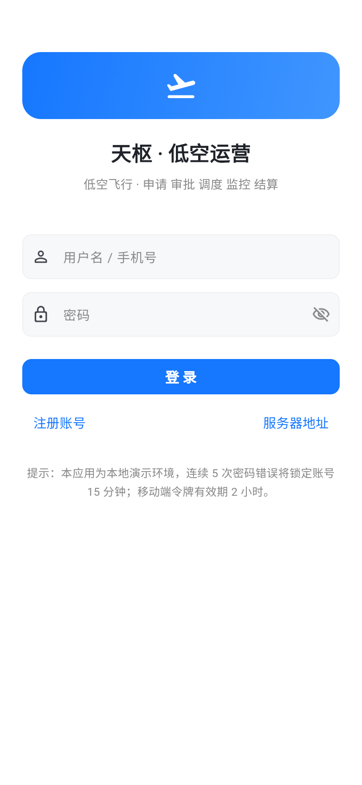
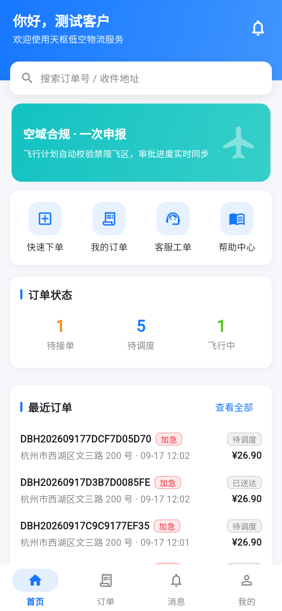
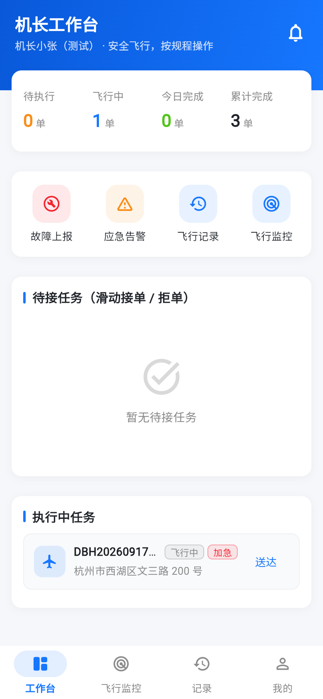

# 天枢 · 低空智能运营管控平台（Dubhe）

面向低空物流场景的运营管控平台，**一仓三端**：PC 管理端（Angular）+ 移动端（Flutter）+ 后端服务（ASP.NET Core 10 / PostgreSQL）。
覆盖「下单 → 调度 → 飞行监控 → 空域合规 → 结算开票 → 应急客服」的完整业务闭环，可用于演示无人机配送平台的运营与监管能力。

> 本项目为教学/演示性质：空管数据、支付、推送等均为模拟实现，未对接真实外部系统；已知限制见各端说明文档。

## 功能概览

- **M1 账号与权限**：注册 / 登录 / 令牌刷新（旋转式）、RBAC（10 角色 / 29 权限点）、商家审核、冻结解冻、审计日志；`Device-Type` 区分 PC（8h 令牌）与移动端（2h 令牌）。
- **M2 订单全流程**：费用预估、下单、模拟支付、接单/拒单/派单、飞行状态机、评价、退款；Excel 批量导入（含校验与错误行返回）、自动接单规则、多角色数据隔离。
- **M3 低空资源**：飞行器台账、起降场站与时段预约、机长/人员资质与排班、维保计划与记录、故障上报闭环；超期维保或资质过期自动禁止调度。
- **M4 空域合规**：禁飞/限飞/临时管制区、商家电子围栏、飞行计划申报与审批（含规则化审批建议）、位置监控与偏航/闯入检测、违规处理与分级处罚。
- **M5 统计与报表**：管理员 / 商家 / 空管三套看板，自定义报表（字段目录、模板、共享、Excel 导出）。
- **M6 应急与客服**：应急告警分级上报 → 下发处置 → 进展 → 关闭归档；客服工单全流程与满意度统计；帮助中心。
- **M7 系统配置**：基础参数、外部接口注册与连通性测试、备份与恢复、操作日志导出与清理。
- **选做 · 智能体骨架**：知识库 / 任务 / 协定 API 与持久化（未接入真实 LLM 与向量检索）。

## 仓库结构

```
.
├── backend/        # ASP.NET Core Web API（Dubhe.Domain/Application/Infrastructure/Api 四层 + xUnit 测试）
├── frontend/       # Angular PC 管理端（管理员/商家/客户/空管/调度/财务/运维等全角色页面）
├── mobile_app/     # Flutter 移动端（客户 / 机长 / 运维 / 移动管理员）
├── scripts/        # 本地联调辅助脚本（Windows 移动热点）
├── start-all.bat / stop-all.bat   # Windows 一键起停（后端 + PC 前端 + 移动热点）
├── 需求分析文档.md / 技术选型文档.md / 系统设计报告.docx
└── 后端说明文档.md / 前端说明文档.md / 移动端说明文档.md / 测试账号文档.md
```

## 技术栈

| 端 | 主要技术 |
| --- | --- |
| 后端 | ASP.NET Core Web API（.NET 10 LTS）、EF Core 10 + Npgsql（PostgreSQL 17/18 + pgvector）、JWT + RBAC、Serilog、SignalR、OpenAPI + Scalar、xUnit |
| PC 端 | Angular（standalone + signals）、ng-zorro-antd、ECharts、@microsoft/signalr、Vitest |
| 移动端 | Flutter（Riverpod / Dio / go_router / flutter_secure_storage）、自绘地图（无第三方地图 Key） |

## 快速开始

前置：.NET SDK 10、Node.js 22+、Flutter 3.x（移动端）、PostgreSQL 或 Docker。

### 1. 后端

```powershell
cd backend

# 启动数据库（推荐 Docker）：先复制 .env.example 为 .env 并设置本地口令
docker compose up -d

# 配置本地凭证（用户机密，不进入版本库）
cd src/Dubhe.Api
dotnet user-secrets init
dotnet user-secrets set "ConnectionStrings:Postgres" "Host=localhost;Port=5432;Database=dubhe;Username=dubhe;Password=<与 .env 相同的口令>"
dotnet user-secrets set "Jwt:SigningKey" "<至少 32 字符的随机字符串>"
# 可选：指定初始管理员口令；留空则首次启动随机生成并打印一次
# dotnet user-secrets set "Seed:AdminPassword" "<你的初始管理员口令>"
cd ../..

dotnet build Dubhe.slnx
dotnet run --project src/Dubhe.Api     # 启动时自动迁移与种子 → http://localhost:5180
```

- Scalar API 文档：`http://localhost:5180/scalar/v1`
- 详细说明与接口清单：`backend/README.md`

### 2. PC 端

```powershell
cd frontend
npm install
npm start          # http://127.0.0.1:4200（代理到 5180）
```

### 3. 移动端

```powershell
cd mobile_app
flutter pub get
flutter run -d chrome --web-port 4200   # Web 调试；真机/模拟器见 mobile_app/README.md
```

### 一键启动（Windows）

```powershell
.\start-all.bat    # 后端(5180) + PC 前端(4200) + Windows 移动热点
.\stop-all.bat
```

## 测试账号与验证

- 账号清单、复现方式与各角色验证路径：**《测试账号文档.md》**（仓库不含任何明文口令，需在部署/注册时自行设置）。
- 后端单元测试：`dotnet test backend/tests/Dubhe.Tests`。
- 端到端冒烟：`backend/scripts/smoke-test.ps1`、`mobile-smoke.ps1`、`mobile-smoke-2.ps1`（口令通过 `DUBHE_ADMIN_PASSWORD` / `DUBHE_TEST_PASSWORD` 环境变量传入）。
- 移动端 Web UI 巡检：`mobile_app/tool/mobile-ui-check.mjs`（Playwright，截图见 `mobile_app/tool/shots/`）。

<p align="center">
  
  
  
</p>

## 文档索引

| 文档 | 内容 |
| --- | --- |
| 《需求分析文档.md》 | 角色、业务需求、非功能需求与需求评审结论 |
| 《技术选型文档.md》 | 技术选型与架构决策 |
| 《系统设计报告.docx》 | 总体设计、模块设计、数据库与接口设计 |
| 《后端说明文档.md》 / `backend/README.md` | 后端架构、配置项、接口速览、测试与验证 |
| 《前端说明文档.md》 / `frontend/README.md` | PC 端页面、约定与验证记录 |
| 《移动端说明文档.md》 / `mobile_app/README.md` | 移动端功能矩阵、联调记录与已知限制 |
| 《测试账号文档.md》 | 测试账号、测试数据与角色验证路径 |

## 安全说明

仓库遵循「**不提交任何明文凭证**」原则：

- 数据库口令、JWT 密钥、初始管理员口令一律通过 **.NET 用户机密或环境变量**（`ConnectionStrings__Postgres`、`Jwt__SigningKey`、`Seed__AdminPassword`）配置；`appsettings.Development.json` 中仅为占位符。
- `docker compose` 的数据库口令来自本地 `backend/.env`（已 git 忽略），模板见 `backend/.env.example`。
- 初始管理员口令若未配置，将在首次启动时随机生成并仅在日志打印一次。
- 日志、运行时备份、构建产物与 IDE 文件均已被 `.gitignore` 排除。

> 注意：后端暂未提供修改密码接口，任何非本地环境的部署请先补充改密能力并更换全部初始口令（详见《前端说明文档》§6 与《测试账号文档.md》§5）。
